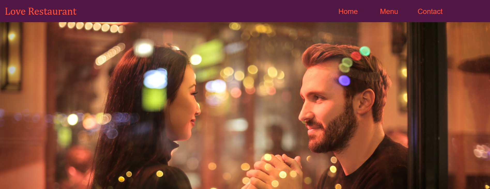

<h1 align="center">:fork_and_knife: Restaurant Page Project</h1>

  

## :pencil: Description

This project consists of the development of a website for a restaurant through the use of modules and the DOM manipulation. Webpack was also used to manage content such as images, CSS styles and Javascript code. The objective of this project was to generate everything using Javascript code, without adding html tags directly within the file.

I want to highlight that I made my own responsive system, so that the application works with a unique grid system created by me, there is no use of external frameworks.

## :heavy_check_mark: Odin Projet Link

[Restaurant Project](https://www.theodinproject.com/courses/javascript/lessons/restaurant-page)

## :point_right: Functionalities

- Home page with general informatión about the restaurant.
- Menu page with all dishes offered by the restaurant.
- Contact Page which includes a contact form.

## :computer: Languages and Tools

- HTML
- CSS
- Javascript
- Photoshop

## Author

:man: Julian Belmonte

- Github: [@jucora](https://github.com/jucora)
- Twitter: [@Julian Belmonte](twitter.com/JulianBelmonte)
- Linkedin: [Julian Belmonte](linkedin.com/in/julianbel)
- Blog: [Medium](https://medium.com/@artjulius)
